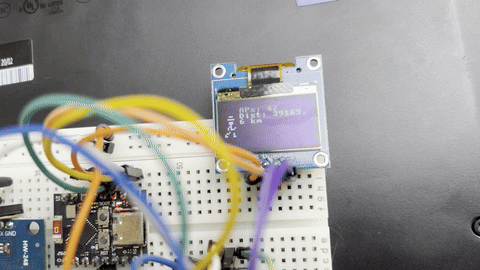

# warking


ESP32-C3 portable wardriving device with GPS logging, an SSD1306 display, and WiGLE-compatible CSV export to SD card.

<p align="center">
  
</p>

## Overview

warking scans for nearby WiFi access points, tags each with a GPS location and timestamp, and logs the results to a WiGLE-format CSV file on an SD card. A small SSD1306 OLED display shows live status (AP count, distance walked).

## Hardware

- ESP32-C3
- NEO-6M GPS module (UART)
- SSD1306 OLED display (I2C)
- microSD card module (SPI)

## Building

This project uses ESP-IDF.

```bash
idf.py set-target esp32c3
idf.py build
idf.py flash (monitor)
```

## Firmware Releases

Pre-built binaries (`bootloader.bin`, `partition-table.bin`, `warking.bin`, `warking.elf`) are attached to each [GitHub Release](../../releases). Flash with:

```bash
esptool.py --chip esp32c3 write_flash \
  0x0     bootloader.bin \
  0x8000  partition-table.bin \
  0x10000 warking.bin
```

## UI

The on-device UI is built with [SquareLine Studio](https://squareline.io/) and LVGL. Exported UI files live in `components/ui/`.

## TODO

- [ ] Make the UI fancier
- [ ] Design a PCB
- [ ] Distance calculation fix
